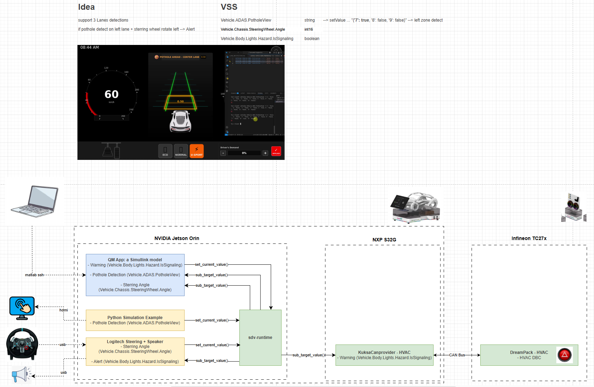

# Dreamkit – Pothole Alert Demo

This folder contains a **playground prototype** that demonstrates how a
MATLAB/Simulink control algorithm can be integrated with digital.auto
components running on a dreamkit target (e.g. NVIDIA Jetson Orin).

---

## Implementation details

The demo implements a **Pothole Alert** system:
The following diagram shows the complete system flow:

<p align="center">
  
</p>

<p align="center">
  <em>Pothole Alert System Architecture – Dreamkit Integration</em>
</p>


1. A **simulation script** (`simulate_pothole.py`) running on the Jetson
   generates synthetic pothole data and publishes it to the
   **digital.auto SDV Runtime** using Vehicle Signal Specification (VSS) signals.
   This simulates the output of a real camera-based perception system.

2. A **Logitech steering wheel** connected to the Jetson provides steering
   angle input via scripts that bridge the dreamkit to digital.auto sdv-runtime, making the
   steering data available as VSS signals.

3. Three Python **bridge services** bridge data between digital.auto sdv-runtimeand the Simulink
   model via Unix Domain Sockets (UDS):
   - `pothole_feeder.py` — subscribes to digital.auto sdv-runtimepothole data and exposes it over UDS
   - `steering_feeder.py` — subscribes to digital.auto sdv-runtimesteering data and exposes it over UDS
   - `hazard_listener.py` — listens for hazard signals on UDS and publishes them back to digital.auto sdv-runtime

4. The **Simulink model** (`PotholeAlertModel.slx`) running in External Mode
   reads pothole and steering data from the UDS sockets at each model step,
   evaluates whether the vehicle is steering towards a lane with a detected
   pothole, and outputs a hazard signal if true.

5. The hazard signal from Simulink is then written back to digital.auto sdv-runtime via
   `hazard_listener.py`, closing the loop.

---

## Repository Structure

```
dreamkit/
├── README.md                  # This file
├── c_caller/
│   ├── da_connector.h         # C header – function declarations for Simulink C Caller blocks
│   ├── da_connector.c         # C implementation – reads/writes UDS sockets from Simulink
│   ├── pothole_feeder.py      # digital.auto sdv-runtime → UDS bridge for pothole zone data (left/right)
│   ├── steering_feeder.py     # digital.auto sdv-runtime → UDS bridge for steering wheel angle
│   └── hazard_listener.py     # UDS → digital.auto sdv-runtime bridge for hazard signal output from Simulink
└── model/
    ├── PotholeAlertModel.slx  # Simulink model (open in MATLAB to view/edit)
```


---

## Prerequisites

### Dreamkit (Linux / NVIDIA Jetson)

- Python 3.12+
- A running digital.auto sdv-runtime instance with custom VSS file
  - Download the custom VSS file from the [Eclipse SDV Playground model](https://playground.digital.auto/model/6875ec635430c81ab197d7bf/api/covesa/Vehicle)

### Host Machine (Windows / MATLAB)

- MATLAB R2025b :
  - Simulink
  - Simulink Coder
  - MATLAB Coder
  - MATLAB Coder Support Package for NVIDIA Jetson and NVIDIA DRIVE Platforms
- SSH access to the target machine

---

## How to Run the Demo

### 1. Start digital.auto sdv-runtime on the Target

The digital.auto sdv-runtime docker container automatically starts after boot in Dreamkit.

### 2. Deploy and Start the Bridge Services

Copy the `c_caller/` folder to the Dreamkit, then start all three services:

```bash
python3 pothole_feeder.py &
python3 steering_feeder.py &
python3 hazard_listener.py &
```

### 3. Open and Run the Simulink Model

1. Open `model/PotholeAlertModel.slx` in MATLAB/Simulink.
2. Ensure the model's hardware board is set to **NVIDIA Jetson** and the
   target IP matches your device.
3. Build and deploy using **External Mode** to run the model on the target
   while streaming signals back to Simulink for visualization.

### 4. Observe the Results

- The Simulink Data Inspector will show live pothole detection, steering
  angle, and hazard signal traces.
- In digital.auto sdv-runtime, `Vehicle.Body.Lights.Hazard.IsSignaling` will toggle based on
  the model's output.
- The behavior can also be visualized in the **digital.auto Playground prototype**:  
   - https://playground.digital.auto/model/69a686b45ee0670962b69bb2/library/prototype/69c623b738bb8e98f0a9d41d/code  
   - Provides interactive validation of the demo scenario

---

## Architecture Notes

### UDS Socket Communication

Each bridge service exposes a Unix Domain Socket. The Simulink-generated
code (via `da_connector.c`) connects to these sockets at every model step
to read inputs and write outputs. The sockets used are:

| Socket Path | Direction | Data |
|---|---|---|
| `/tmp/kuksa_pothole_left.sock` | digital.auto sdv-runtime → Simulink | `"true"` / `"false"` |
| `/tmp/kuksa_pothole_right.sock` | digital.auto sdv-runtime → Simulink | `"true"` / `"false"` |
| `/tmp/kuksa_steering_angle.sock` | digital.auto sdv-runtime → Simulink | Numeric string (e.g. `"-15.5"`) |
| `/tmp/kuksa_hazard_signal.sock` | Simulink → digital.auto sdv-runtime | `"true"` / `"false"` |

### Steering Angle Convention

The demo uses the following steering angle convention (based on Logitech
steering wheel input):

- **Positive values:** Vehicle steering wheel turned **right**
- **Negative values:** Vehicle steering wheel turned **left**
- **Zero:** Straight ahead

Example:
- `+25.0°` → steering right by 25 degrees
- `-15.5°` → steering left by 15.5 degrees
- `0.0°` → steering straight

This convention aligns with the VSS standard for
`Vehicle.Chassis.SteeringWheel.Angle`.

---

## Current Work: SDV Runtime Integration

**Status:** In Progress  
**Target:** Integrate MATLAB/Simulink with Eclipse SDV Runtime for Pothole Alert demo

### Key References for Integration

-   [MATLAB Coder Support Package for NVIDIA Jetson and NVIDIA DRIVE Platforms](https://www.mathworks.com/help/coder/nvidia.html)
-   [Eclipse SDV Runtime Documentation](https://docs.digital.auto/docs/epic/runtime/architecture/index.html)
-   [Pothole Alert Prototype](https://playground.digital.auto/model/69a686b45ee0670962b69bb2/library/prototype/69c623b738bb8e98f0a9d41d/view)

---

## License

Copyright (c) 2025 Eclipse Foundation.

This program and the accompanying materials are made available under the
terms of the [MIT License](https://opensource.org/licenses/MIT).

SPDX-License-Identifier: MIT
